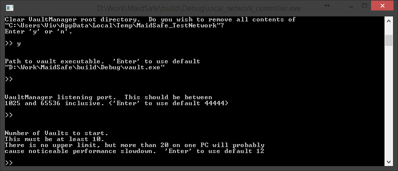

# Lokale Netzwerk Einrichtung

Nachdem Du die Entwicklungsumgebung auf Deinem Rechner eingerichtet hast begeben wir uns an den '**local_network_controller**'. Dieses Tool dient als Client um sich zum "Vault Manager" zu verbinden und das Netzwerk mit einer Reihe von "Vaults" zu starten die wir in zukünftigen Beispielen  verwenden können.

* Baue den 'local_network_controller'
* Starte das Tool und Du solltest in etwa das hier sehen

> Tipp: Wenn Du detailierte Infos möchtest, kannst du  `--log_* V` als Parameter beim Starten übergeben. Alle Logfile Optionen findest Du [hier](https://github.com/maidsafe/MaidSafe/wiki/Logging-Options#invoking-logging-arguments)

Für dieses Beispiel starten wir mit der Option 1, anschliessend mit Enter bestätigen. Diese Option startet ein neues Netzwerk auf diesem Rechner.

Wo es passend ist, kannst Du dem Tool verschiedene individuelle Optionen übergeben, z.B. "Pfad zur Vault Anwendung" oder "Anzahl der Vaults mit der das Netzwerk laufen soll". Mit den Standard Optionen sollte das Tool wie folgt aussehen

Mit der Standard Option für den "Vault Zähler" richtet das Tool ein Netzwerk mit 12 Vaults ein. (**Dieser Prozess kann ein paar Minuten dauern**). Zusätzlich werden 2 extra Vaults (Null Status Knoten) erstellt, welche während der sogenannten Bootstrapping Phase wieder zerstört werden.

Ein Problem bei der Erstellung eines neuen Netzwerkes (Null Status) ist das die Vaults nicht validieren können wozu sie sich verbinden da sich bisher kein Vault im Netzwerk registriert hat. Vault Regstrierung bedeutet das der öffentliche Schlüssel im Netzwerk gespeichert wurde - das kann natürlich nicht geschehen *bevor* das Netzwerk existiert.

Um das zu umgehen erstellen wir ein Schlüsselpaar (eines per Vault) bevor wir das Netzwerk starten. Der Vault Manager verteilt diese Liste an jeden Vault der durch ihn gestartet wird. Dadurch bekommen die Vaults die Schluessel der anderen Vaults von dieser Liste anstatt durch das Netzwerk.

Sobald das Netzwerk gestartet ist speichert das Tool die Schlüssel korrekt und das Netzwerk verhält sich ab diesem Punkt normal.

Jeder Vault muss zu einer Mindestanzahl an weiteren Vaults verbunden sein bevor es sich selbst innerhalb eines Netzwerkes sieht. Aus diesem Grund erfordert das Tool eine minimale Größe des Netzwerks von momentan 10 Vaults.

Davon ausgehend das alles vernünftig läuft, solltest Du jetzt folgendes sehen:

Wie auf dem Screenshot zu sehen ist muss das Tool weiterlaufen um das Test Netzwerk auf diesem Rechner am Leben zu erhalten. Damit sind wir am Ende dieses Beispiels. Wenn Du das hier liest, hast Du hoffentlich erfolgreich ein Test Netzwerk zum Laufen gebracht. Glückwunsch!

