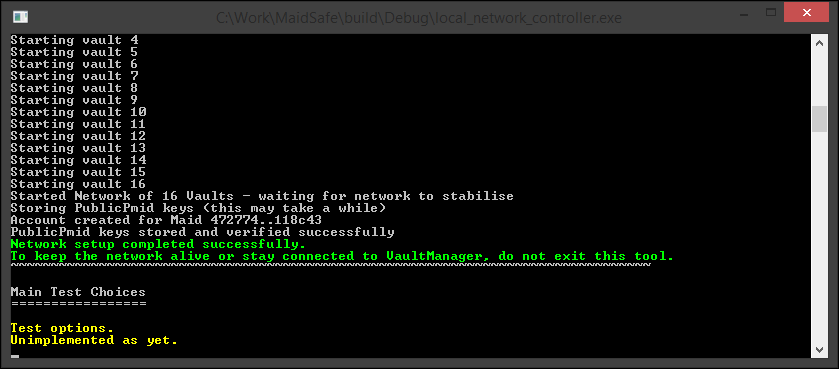

# Requirements

### API Project:

Please refer to the [Network Setup - Requirements](./../001_network_setup/requirements.md) to get your build environment set up for the MaidSafe Super-Project.

This example requires the following target to be built from the MaidSafe Super-Project.

* `maidsafe_api` - This will get the API project library built and ready to use from any external project.

### [MaidSafe-Examples](https://github.com/maidsafe/maidsafe-examples) Source Code

Clone the Github project to a preferred location on your machine. This project contains any code samples that the examples series will rely on in the `code` folder.

Now from somewhere outside the Examples project root we need to run:

    cmake -H<path to MaidSafe-Examples/code> -Bbuild_maidsafe_examples -DMAIDSAFE_BINARY_DIR=<path to maidsafe Super-Project build folder>

Go ahead and build the `authentication` target from the examples project.

# Network Options

### Connect to the MaidSafe Testnet

Requires no setup for now (yay!). This is currently the default option that any client code will use until the network is live. Testnet bootstrap endpoints are hardcoded in the submodule libraries to achieve this functionality.

With the testnet being, well... "a **test** network", please do be aware that it might not be stable and functional 24/7. If you wish to run the example on the Testnet, do check the bootstrap conncectivity status via the following link to make sure there aren't any problems on the testnet before connecting to it.

[Testnet Status](http://visualiser.maidsafe.net:8080/testnet-status)

^^ Status page will be auto updated once every 10 minutes to give the latest connectivity status.

### Run Your Own Small, Local Testnet

This requires a small setup process (*sad*).

* `local_network_controller` - As seen in the [Network Setup](./../001_network_setup/intro.md) example, this target currently helps us run a local test network on a single machine we can use for examples to run on and function.

Make sure to have the `local_network_controller` up and running. You should leave it running with the following message displayed

* This tool will generate a file named `local_network_bootstrap.dat` in the same folder as the tool's executable. Copy this file to the folder that contains the `authentication` example executable.
* Finally rename the file we copied into the `authentication` example's executable folder as `bootstrap_override.dat`

Running the example now will make it use the `bootstrap_override.dat` file it finds in its own folder and thereby connect to the Local Network on the same machine. To switch back to using the testnet, you just need to stop the running example, remove the `bootstrap_override.dat` file, then run the example again.
