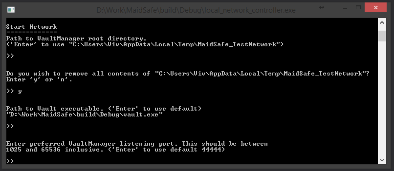

# Local Network Setup

So now that you have the build environment set up on your machine, the target we require for this example is '**local_network_controller**'. This serves as a client to connect to the vault manager and start the network with a bunch of vaults which we can then connect to in future examples.

* Go ahead and build the target 'local_network_controller'

> Tip: If you want to see detailed logging info, you can pass `--log_* V` when invoking the tool.  For full logging options, see [this wiki page](https://github.com/maidsafe/MaidSafe/wiki/Logging-Options#invoking-logging-arguments).

* Run the tool and you should see something like:

For this example we are going to go with option "1". Hit "1" and Enter. This lets us start a new network on this machine.

You can provide custom settings where applicable for the various options in the tool such as "Path to vault Executable" or "Number of Vaults to run the network with". Following the default options, you should see the tool function such as

Now with the default option for "Vault count" the tool sets up a network with 12 Vaults (**this process may take a few minutes**). There are 2 extra vaults (zero state nodes) that are created as part of this process which get destroyed during the bootstrap phase.

The issue is that for a brand new (i.e. "zero state") network, the Vaults aren't able to validate who they are connecting to, since no Vault has properly registered itself onto the network.  Vault registration involves storing the Vault's public keys onto the network - clearly this can't have happened *before* the network exists!

To get round this, we create a bundle of keys (one per vault) before the network starts, and the vault manager distributes the full list to each Vault it starts.  Thus the Vaults can cheat and get any of the initial peers' keys from this list rather than from the network.

Once the network has started, the tool proceeds to store the public keys to the network properly, and at that stage, the network can behave normally.

Each Vault needs to be connected to a minimum number of peer Vaults before it considers itself joined to the network.  For this reason the tool enforces a minimum local network size  (currently 10).

Provided everything runs fine, you should now see something like:

As the message in the screenshot explains, we need to keep this tool running to keep the test network going on this machine. That brings us to the end of "Example 0". If you're reading this, we hope you've got a test net running on your machine, so gratz!!

