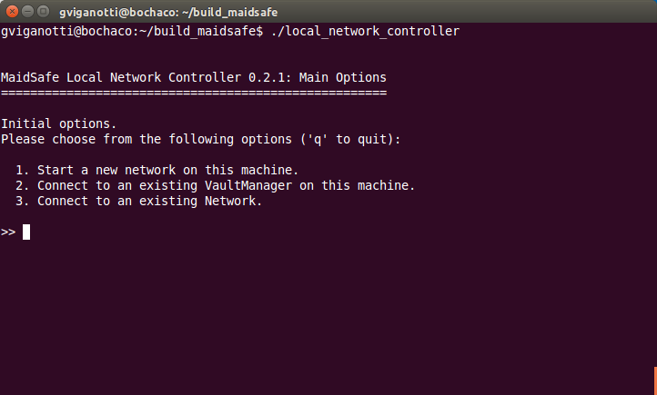
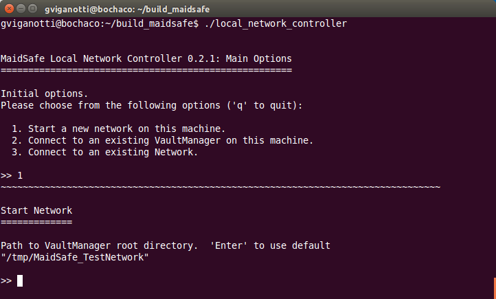
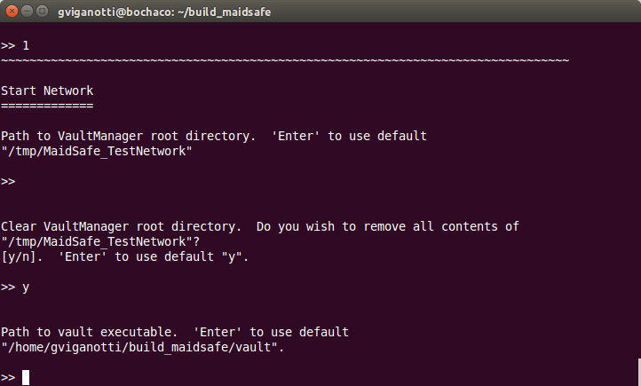
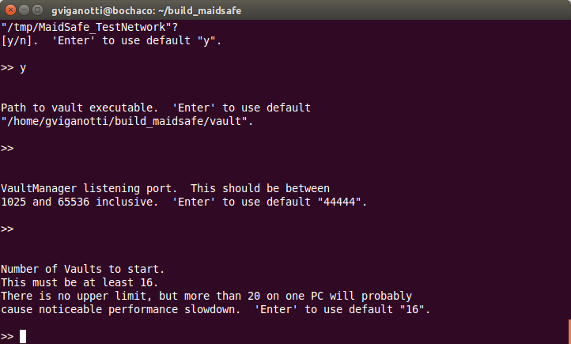
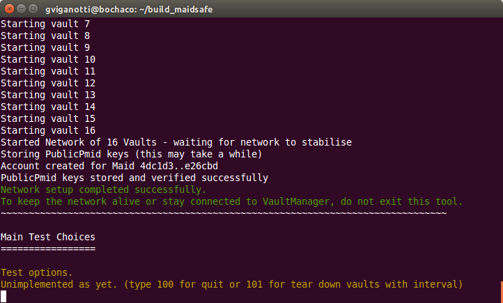

# Configuración de una Red local

Ahora que ya tenés el entorno de compilación configurado en tu computadora, el 'target' de compilación que necesitamos para este ejemplo es '**local_network_controller**'. Esta herramienta actúa como un cliente para conectarse al 'Vault Manager' y ejecuta la red con un conjunto de 'Vaults' a los que podremos conectarnos con otros ejemplos en el futuro.

* Compilá el 'target' de compilación `local_network_controller`
* Ejecutá la herramienta y deberías ver algo como lo siguiente:

> Consejo: Si deseás ver información detallada de log, podés pasar los parámetros `--log_* V` cuando ejecutás la herramienta.  Para saber más acerca de todas las opciones de log disponibles, consultá [esta wiki](https://github.com/maidsafe/MaidSafe/wiki/Logging-Options#invoking-logging-arguments).

Para este ejemplo debemos seleccionar la opción "1". Tipeá "1" y luego Enter. Esto crea una nueva red local en esta misma computadora.

Podés proveer cofiguraciones personalizadas para cada una de las opciones de esta herramienta como ser el "Path para ejecutable del Vault" o el "Número de Vaults a ejecutarse en la red". Con los valores por defecto, deberías ver la herramienta ejecutarse de la siguiente manera

Con el valor por defecto para la opción "Número de Vaults" la herramienta configura una red con 16 'Vaults' (**este proceso puede durar varios minutos**). Hay 2 vaults adicionales (zero state nodes) que son creados durante este proceso y que son destruídos durante la fase de inicialización de la red.

El problema es que en una red nueva (es decir recien creada), los 'Vaults' no pueden validar a donde se están conectando, dado que ningún 'Vault' se ha registrado a la red.  El proceso de registración de un 'Vault' implica almacenar la clave pública del 'Vault' en la red - claramente esto no podría suceder *antes* de que la red exista!

Para darle una solución a este problema, se crea un conjunto de claves (una por cada vault) antes de que se inicie la red, y el 'vault manager' distribuye la lista completa a cada 'Vault' que éste va iniciando.  De esta manera los 'Vaults' pueden obtener la clave de cualquiera de los otros 'Vaults' desde dicha lista en vez de obtenerla desde de la red.

Una vez que la red se ha iniciado, la herramienta procede a almacenar las claves públicas en la red, y en ese momento, la red puede funcionar normalmente.

Cada 'Vault' necesita estar conectado a un mínimo número de otros 'Vaults' antes de que él mismo se considere parte de la red.  Por esta razón la herramienta exige un tamaño mínimo para la red local (actualmente 16).

Asumiendo que todo se ejecutó correctamente, deberías ver algo parecido a la siguiente pantalla:

Tal como lo indica el mensaje en la pantalla, debemos mantener esta herramienta ejecutándose para tener la red corriendo localmente en esta computadora. Con esto damos por finalizado este Ejemplo. Si estás leyendo esto, esperamos que hayas logrado tener tu red ejecutándose localmente en tu computadora, así es que felicitaciones!!
