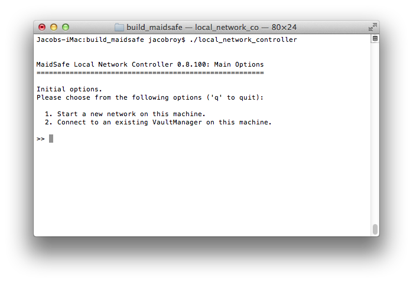
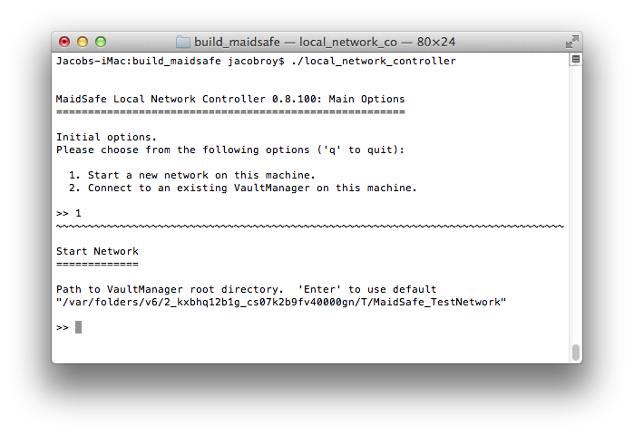
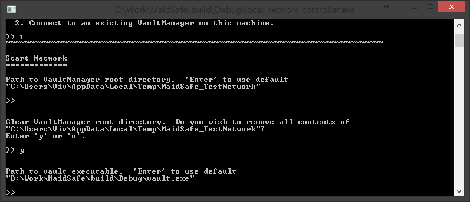
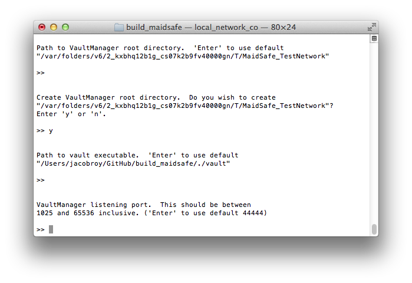
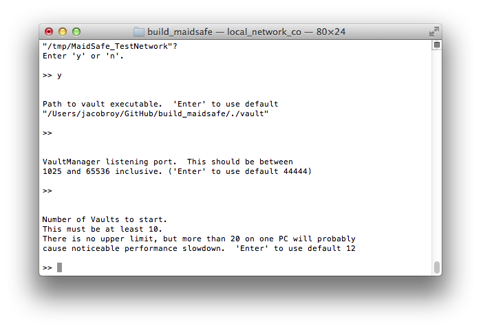
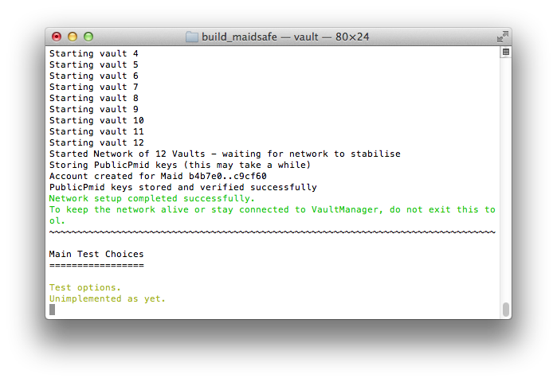

# Configuration du réseau local

Maintenant que vous avez configuré l'environement de compilation, la cible (target) requise pour cet exemple est '**local_network_controller**'. Ceci est utilisé comme un client pour se connecter au gestionnaire de vault et lancer le réseau avec un certain nombre de vaults desquels on peut se connecter dans de futures exemples.

* Compilez la cible 'local_network_controller' (Sur Unix, make local_network_controller)
* Lancez l'outil (local_network_controller) et vous devrez voir quelque chose comme cela:

> Tip: Si vous voulez voir un log plus détaillé, vous pouvez ajouter `--log_* V` en lancant l'outil. Consultez [cette page wiki](https://github.com/maidsafe/MaidSafe/wiki/Logging-Options#invoking-logging-arguments) pour des options de log plus complètes.

Pour cet exemple, nous allons choisir l'option "1". Tapez "1" et Enter. Cela nous laisse créer un nouveau réseau sur cette machine.

Vous pouvez utiliser des paramètres personnalisés, où applicable, pour de nombreuses options dans l'outil. Par exemple, "Path to vault Executable" (chemin vers l'éxecutable des vault) ou "Number of Vaults to run the network with" (nombre de vaults à lancer sur le réseau local). Suivant les options par défaut, vous devriez voir l'outil fonctionner comme ceci:

En utilisant les options par défaut pour le nombre de vault, l'outil configure le réseau avec 12 Vaults. Il y a deux vaults d'extra (zero state nodes) qui sont créées pendant le processus, et seront détruite pendant la phase de bootstrap.

Le problème est que pour les réseau tout neuf (zero state), les Vaults de sont pas capables de valider à qui elles sont connectées car aucunes Vaults ne s'est encore enregistrée sur le réseau. L'enregistrement d'une vault sur le réseau demande le stockage de la clé publique de cette Vault sur le réseau. Evidemment, cela n'as pas pu avoir lieu *avant* que le réseau n'existe!

Pour contourner ce problème, nous créons un ensemble de clés (une par Vault) avant de lancer le réseau. L'organisateur de Vault (vault manager) distribue la liste complète de clés à toutes les Vaults avant le lancement. Ainsi, les Vaults peuvent tricher et avoir toutes les clés à partir de la liste au lieu d'à partir du réseau.

Tout de suite après que le réseau soit lancé, l'outil va stocker les clés publiques proprement sur le réseau. À cette étape, le réseau peut fontionner normalement.

Chaque Vault à besoin d'être connectée à un nombre minimum d'autres Vaults avant de se considérer commme faisant partie du réseau. C'est pour cette raison que l'outil demande un minimum de 10 Vaults pour un réseau local.

Si tout fonctionne bien, vous devriez recevoir ce message suivant:

Comme l'explique le message, il faut garder l'outil en marche pour garder le réseau de test vivant sur cette machine. 

C'est maintenant la fin de cette exemple, si vous lisez ceci nous espérons que vous avez réussis à lancer le réseau de test sur votre machine, bravo!

